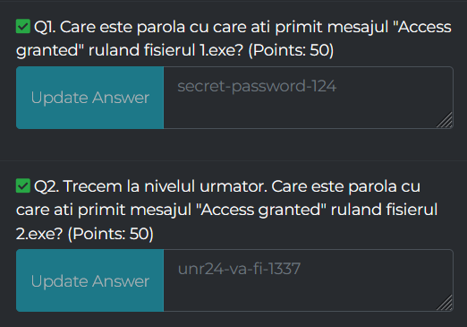
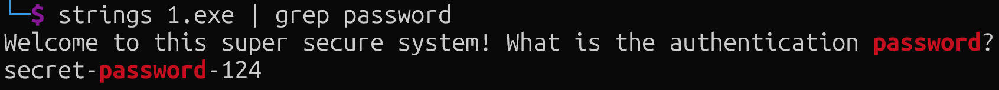
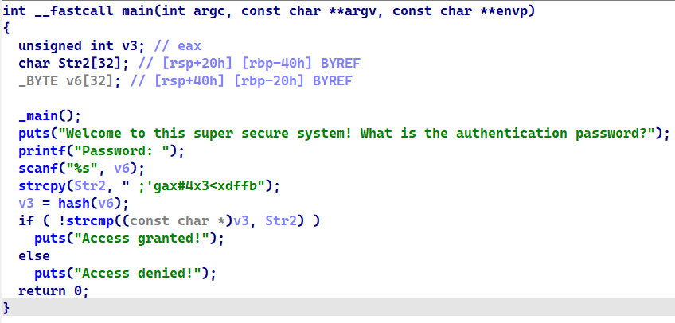
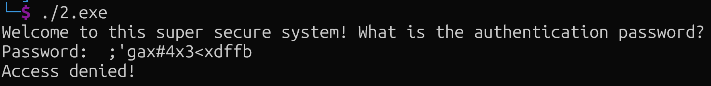
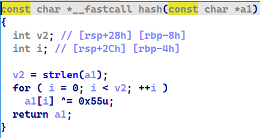
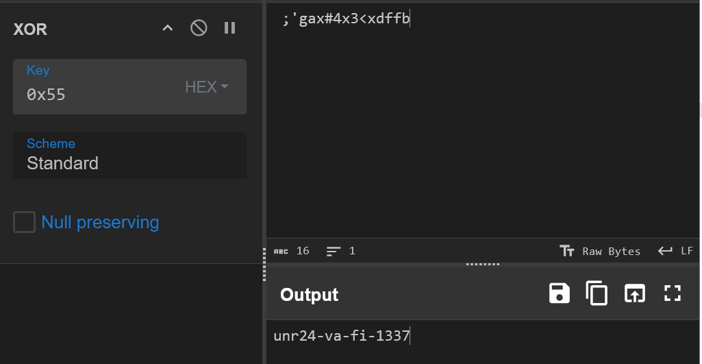
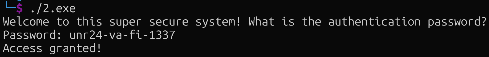

Ce este ingineria inversa?


DESCRIPTION:

"Reverse Engineering" (sau "Ingineria Inversă") este un fel de "detectivistică tehnologică". Să îți imaginezi că ai un jucărie robot foarte cool și vrei să afli cum funcționează. În loc să începi cu instrucțiuni și piese pentru a-l construi, începi cu robotul finit și îl desfaci bucățică cu bucățică pentru a înțelege cum a fost asamblat și cum funcționează fiecare parte.

fisiere: 1.exe, 2.exe

Solutia:

One thing about rev, toolurile potrivite ajuta foarte mult. Spre exemplu cele mai populare de reverse engineering sunt ghidra, Ida Pro, x64dbg,pwngdb and so on. Fara mai multe spuse sa incepem:



Q1. Care este parola cu care ati primit mesajul "Access granted" ruland fisierul 1.exe?

Mai intai sa incercam sa vedem daca fisierul are ceva strings "hardcoded".



Am gasit parola folosing un tool super user de folosit:
```bash
strings 1.exe | grep password
```
Ce fac aceste comenzi?

```bash
strings 1.exe
```

Va enumera toate "strings" din acel fisier.

```bash
grep password
```
Va filtra doar cele care contin "password"

O alta methoda prin care putem gasi parola este sa o deschidem intr-un decompiler


Si gasim parola dinnou.

##### Flag: secret-password-124

Q2. Trecem la nivelul urmator. Care este parola cu care ati primit mesajul "Access granted" ruland fisierul 2.exe?

De data aceasta daca incercam sa folosim methoda "strings" nu vom gasi parola asadar continuam cu decompilerul.



Putem vedea stringul " ;'gax#4x3<xdffb" dar daca incercam vom primi Access Denied.



Bun, atunci ar trebui sa recitim codul main ca sa intelegem.

```bash
scanf("%s", v6);
```
Ne salveaza input-ul in variabila v6.

```bash
strcpy(Str2, " ;'gax#4x3<xdffb");
```
Copiaza acel string din dreapta in variabila Str2.

```bash
v3 = hash(v6);
```
Variabila v3 este egala cu rezultatul din functia hash cu inputul variabilei v6. 

Functia hash:



Aceasta functie este o functie de XOR cu byte-ul 0x55.
Adica ia cate un character din variabila Str2 si ii face un calcul matematic prin al descifra.
Pentru a da reverse la aceasta functie putem sa intram pe site-ul cyberchef.com



Reiese parola unr24-va-fi-1337.
Putem sa verificam asta:



##### Flag: unr24-va-fi-1337

