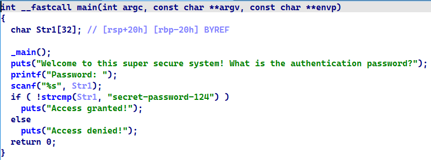

# Ce este Ingineria Inversă?


## DESCRIPTION

"Reverse Engineering" (sau **Ingineria Inversă**) este ca o detectivistică tehnologică: în loc să ai instrucțiunile de construcție ale unui dispozitiv, primești produsul finit și încerci să înțelegi cum funcționează. În acest challenge, vom desfășura două fișiere executabile pentru a descoperi parole ascunse.

---

## Fișiere

- `1.exe`
- `2.exe`

---

## Unelte recomandate

În ingineria inversă, uneltele potrivite sunt esențiale. Cele mai comune includ:
- `strings`
- `Ghidra`
- `IDA Pro`
- `x64dbg`
- `CyberChef`
- `pwndbg` / `gdb`

---

## Q1 – Ce parolă returnează "Access granted" în `1.exe`?

Putem începe căutând șiruri text direct în binar:

```bash
strings 1.exe | grep password
```
Această comandă:

    strings 1.exe afișează toate șirurile text din fișierul binar

    grep password filtrează doar cele care conțin cuvântul "password"

O alta methoda prin care putem gasi parola este sa o deschidem intr-un decompiler



##### Flag: super-password-124

## Q2 – Ce parolă returnează "Access granted" în `2.exe`?

### 1. Metoda `strings` eșuează

Dacă folosim comanda:

```bash
strings 2.exe | grep password
```
...nu găsim nimic relevant. Parola nu este stocată direct ca text în fișier. Trebuie să analizăm binarul mai în profunzime.
