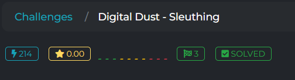
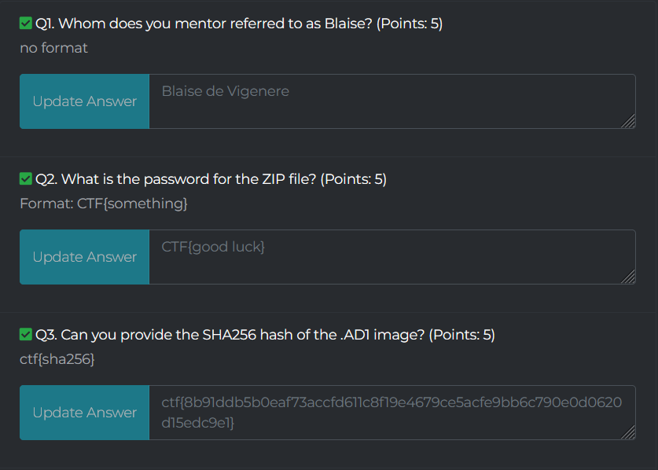

# Digital Dust - Sleuthing 

DESCRIPTION

You are a junior digital forensic investigator assigned to your second case after you did an excellent job with the first case. Your mentor has provided you with a password protected ZIP archive. Additionally, he gave you the password as a challenge, without directly revealing it. The information he shared with you about the password is: the cipher text “abpu pumk”, the cipher key “UNBREAKABLE” and the name Blaise. Your tasks are to find out the password, extract the data from the ZIP archive and answer the following forensic questions.

File: Image.zip

9 Intrebari despre aceasta imagine.

1. Whom does you mentor referred to as Blaise?

Un google search si il gasim Blaise de Vigenere.

## Flag: Blaise de Vigenere

2. What is the password for the ZIP file?

Facem Viginere cypher la parola "abpu pumk" cu cheia "UNBREAKABLE" si primim parola "good luck".

## Flag: CTF{good luck}