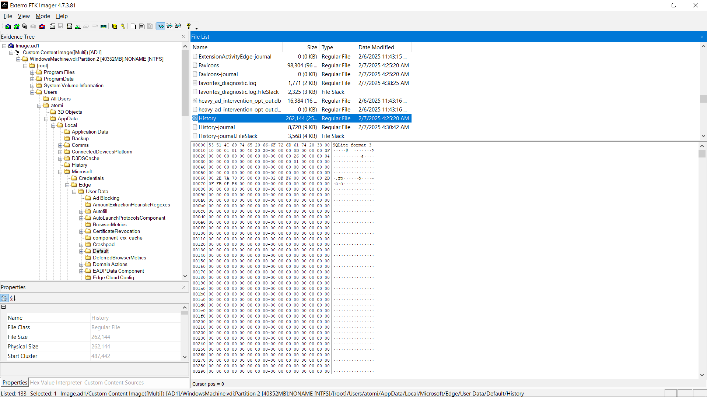

# Digital Dust - Sleuthing 


DESCRIPTION

You are a junior digital forensic investigator assigned to your second case after you did an excellent job with the first case. Your mentor has provided you with a password protected ZIP archive. Additionally, he gave you the password as a challenge, without directly revealing it. The information he shared with you about the password is: the cipher text “abpu pumk”, the cipher key “UNBREAKABLE” and the name Blaise. Your tasks are to find out the password, extract the data from the ZIP archive and answer the following forensic questions.

File: Image.zip

9 Intrebari despre aceasta imagine.


1. Whom does you mentor referred to as Blaise?

Un google search si il gasim Blaise de Vigenere.

##### Flag: Blaise de Vigenere

2. What is the password for the ZIP file?

Facem Viginere cypher la parola "abpu pumk" cu cheia "UNBREAKABLE" si primim parola "good luck".

##### Flag: CTF{good luck}

3. Can you provide the SHA256 hash of the .AD1 image?

Dupa ce extractam fisierul putem sa folosim comanda:
```bash
    sha256sum Image.ad1
```
##### Flag: ctf{8b91ddb5b0eaf73accfd611c8f19e4679ce5acfe9bb6c790e0d0620d15edc9e1}


4. Where can the ransom note be found?

Pentru a deschide fisierul putem sa folosim FTK Imager.

Asadar aflam ca Ransom Note-ul se afla pe Desktop. (pretty straight forward)


##### Flag: C:\Users\atomi\desktop\YOUR_FILES.txt


5. What is the name of the malicious executable file?

De data asta putem sa cautam in downloads si aflam de acest fisier


##### Flag: CTF{purelocker.exe}

6. Which file extension does this malware use?

Tot in downloads putem vedea extensia .CR1

##### Flag: CTF{.CR1}

7. Which network traffic monitoring tool is installed on the system?

Tot in downloads putem vedea wireshark.

##### Flag: CTF{wireshark}


8. Where is the browser history stored on the system?

De data asta daca dau un google search sa vedem unde se salveaza history-ul. Acest user avea doar Microsoft Edge si asa am gasit fisierul.



##### Flag: C:\Users\atomi\AppData\Local\Microsoft\Edge\User Data\Default\History

9. What is the source of the downloaded file?

History este un fisier de tip sqlite3 si cu urmatoarele comezi putem afla:


Cautand prin ele gasim mai multe linkuri de wetransfer.


##### Flag: CTF{wetransfer.com}
