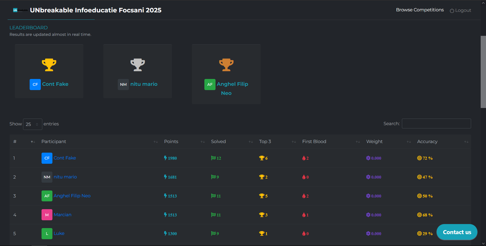

# UNbreakable Infoeducatie Focsani 2025

UNbreakable Infoeducatie Focsani este o competiție locală de tip Capture the Flag (CTF) dedicată elevilor, organizată de Bit Sentinel și Orange România. Evenimentul face parte din inițiativa mai largă UNbreakable România 2025, cel mai complex program național de securitate cibernetică pentru liceeni și studenți.

# Leaderboard

