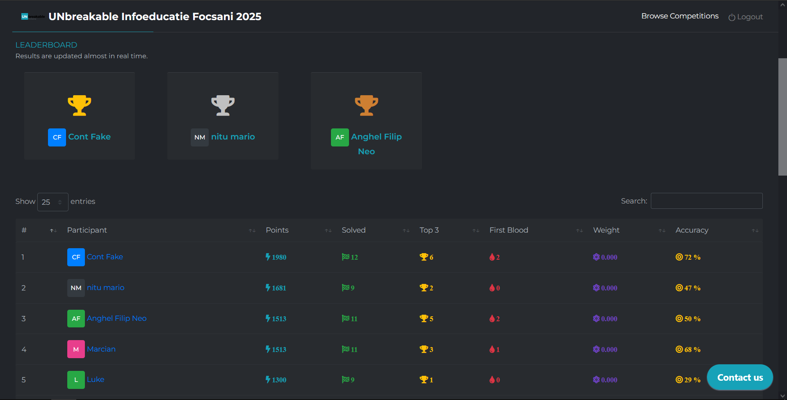

# UNbreakable Infoeducatie Focsani 2025

UNbreakable Infoeducatie Focsani este o competiție locală de tip Capture the Flag (CTF) dedicată elevilor, organizată de Bit Sentinel și Orange România. Evenimentul face parte din inițiativa mai largă UNbreakable România 2025, cel mai complex program național de securitate cibernetică pentru liceeni și studenți.

# Podium

# Dificulty

Usor-Mediu

# Overall

Experienta a fost una super misto si multumim Orange si Unbreakable Romania pentru CTF.

# InfoEducație CTF Writeups

Acest repository conține write-up-uri pentru diverse provocări din cadrul concursului InfoEducație CTF. Fiecare director conține fișierele specifice fiecărui challenge și un `README.md` dedicat.

---

## Index Writeups

- [gaming-habbits](./gaming-habbits/README.md) 

- [digikey](./digikey/README.md)

- [wifi-get-me](./wifi-get-me/README.md)  

- [legacy-computer-game](./legacy-computer-game/README.md)  

- [ping-station-v2](./ping-station-v2/README.md)  

- [merchandise](./merchandise/README.md)  

- [universe](./universe/README.md)

- [Ce este inginerie inversa](./Ce%20este%20inginerie%20inversa/README.md)

- [luma-lacks-love](./luma-lacks-love/README.md)

- [Digital Dust - Sleuthing](./Digital%20Dust%20-%20Sleuthing/README.md) 

