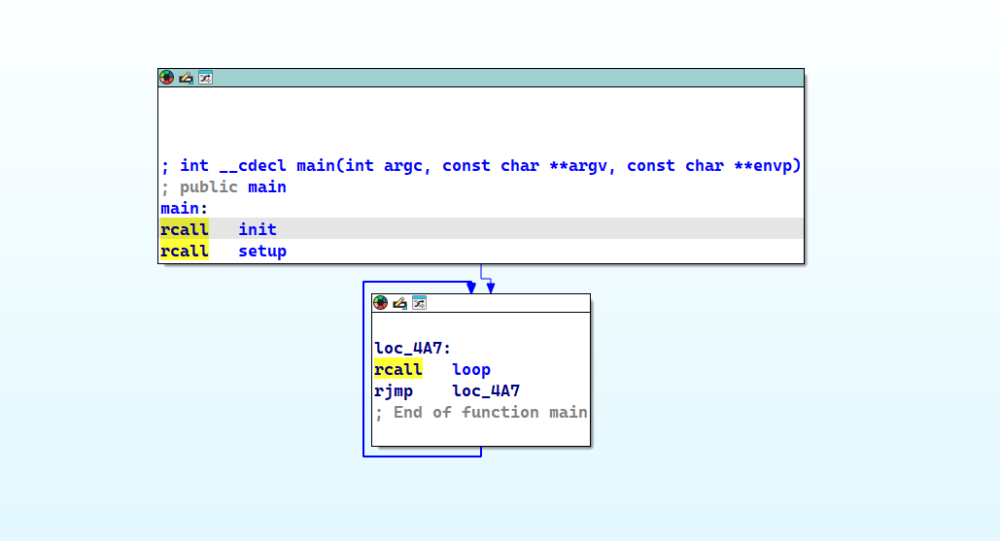
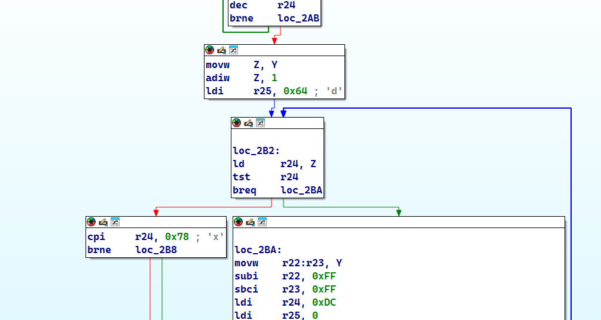
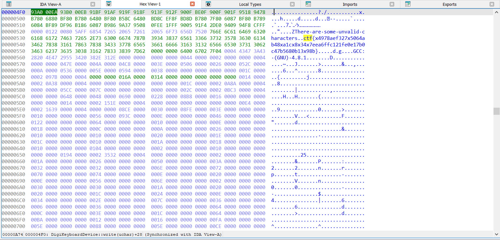

# digikey

## Descriere

Acest challenge conține datele ELF extrase dintr-un chip AVR **ATtiny85** compilat. Dispozitivul era detectat automat ca o tastatură (HID) și introducea într-un loop flag-ul CTF ca șir de caractere.

## Fișier

- `digikey.elf`

## Soluție

Pentru analiză statică se poate utiliza un decompiler precum **IDA** sau **Ghidra**. La deschiderea fișierului ELF în Ghidra/IDA, se observă funcția principală:

Aceasta apelează o funcție de tip loop, în care pare să fie procesat sau reintrodus un șir de caractere:

În cadrul acestei funcții, putem observa în memorie flag-ul (parțial), sub formă de șir constant stocat în secțiunea de date:

### Observație

La o inspecție atentă, se poate vedea că aplicația parcurge fiecare caracter al flag-ului într-un loop. Dacă caracterul este `"d"`, acesta este înlocuit cu `"x"`, așa cum este indicat în logica programului din imaginea 2.

După reconstituirea completă a flag-ului (înainte de înlocuire) și aplicarea transformărilor observate, putem obtine flagul cu usurinta.

## Flag

ctf{d4978aef327d5064ab48da1cd8d34d7eea6ffc121fe0e17b0c47b5680b13d98b}