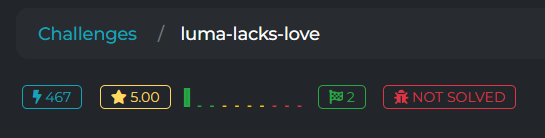

# luma-lacks-love



## Descriere

Avem o sumă modulară de forma:

cool ≡ ∑ aᵢ·xᵢ mod p

unde:
- `p`, `a`, și `cool` sunt cunoscute (date în `output.txt`),
- `xᵢ ∈ {0..15}` — fiecare `xᵢ` este un nibble din reprezentarea hex a unui flag necunoscut.

Scopul: să reconstruim vectorul `x = (x₀, ..., xₙ)` astfel încât să extragem `flag`ul original.

---

## Fișiere

- `source.py` — codul care generează instanța (flag-ul este convertit în hex și înmulțit cu vectorul `a` modulo `p`)
- `solve.py` — script care folosește teoria rețelelor (LLL + Babai) pentru a aproxima soluția

---

## Observații din `source.py`

```python
p = getPrime(512)
a = [random.randint(1, p - 1) for _ in range(len(flag))]
cool = sum(int(flag[i], 16) * a[i] for i in range(len(flag))) % p
```
Flag-ul este convertit în hex (64 nibbles), apoi fiecare cifră este înmulțită cu un coeficient a[i], iar rezultatul se reduce modulo p.

## Soluție

Obiectivul este să reconstruim șirul de `nibbles` (cifre hexazecimale ∈ [0..15]) care formează flag-ul.

### Pasul 1 — Înțelegerea ecuației

Se cunoaște:

cool ≡ ∑ aᵢ·xᵢ (mod p)

Cu:
- `p`: prim mare (512 biți),
- `a`: vector public (coeficienți aleatori),
- `x`: nibbles necunoscuți din flag (64 de valori ∈ [0..15]),
- `cool`: valoarea sumată obținută pe server.

### Pasul 2 — Modelare ca problemă de rețele (lattice)

Construim o rețea de dimensiune 65, cu următoarea structură:

- Linia 0: `[p, a₀, a₁, ..., a₆₃]`
- Liniile 1-64: fiecare linie `i` conține valoarea `16` pe coloana `i+1`, restul zero.

Astfel, soluțiile de forma `[t, x₀, ..., x₆₃]` unde `t·p + ∑ aᵢ·xᵢ = cool` se află în rețea.

### Pasul 3 — Reducere LLL

Se folosește biblioteca `fpylll` pentru a aplica reducerea LLL pe baza acestei rețele:

```python
from fpylll import IntegerMatrix, LLL

B = IntegerMatrix(n + 1, n + 1)
# linia 0
B[0, 0] = p
for i in range(n):
    B[0, i + 1] = a[i]
    B[i + 1, i + 1] = 16

LLL.reduction(B)
```
### Pasul 4 — Aproximare CVP (Closest Vector Problem)

După reducerea bazei rețelei cu LLL, folosim algoritmul CVP pentru a aproxima cel mai apropiat vector de o țintă dată.

Ținta noastră este vectorul `[cool, 0, 0, ..., 0]`, iar obiectivul este să găsim un vector din rețea care este aproape de acesta.

În fpylll:

```python
from fpylll import GSO, CVP

M = GSO.Mat(B)         # B este baza redusă LLL
M.update_gso()         # calculează ortogonalizarea Gram-Schmidt
cvp = CVP(M)           # instanțiază obiectul CVP

target = [cool] + [0]*n
closest = cvp.closest_vector(target)
```

Rezultatul closest este un vector [t·p + ∑ aᵢ·xᵢ, 16·x₀, 16·x₁, ..., 16·x₆₃].

Prin urmare, fiecare valoare de xᵢ poate fi obținută împărțind elementul corespunzător la 16:

```python
x = [closest[i+1] // 16 for i in range(n)]
```

### Pasul 5 — Verificare și reconstruire flag

După ce obținem vectorul cel mai apropiat din rețea folosind CVP, extragem nibble-urile (`xᵢ`) împărțind elementele de la pozițiile 1 încolo la 16:

```python
x = [v // 16 for v in closest[1:]]
```
Apoi verificăm două condiții importante:

    Toate valorile xᵢ trebuie să fie în intervalul valid pentru un nibble (adică 0 ≤ xᵢ ≤ 15);

    Suma ponderată trebuie să se potrivească cu valoarea cool modulo p.

```python
assert all(0 <= v <= 15 for v in x), "Nibble out of range"
lhs = sum(a[i] * x[i] for i in range(len(a))) % p
assert lhs == cool, "Modular sum check failed"
```

Dacă ambele condiții sunt îndeplinite, reconstruim flag-ul:

```python
hex_str = ''.join(f"{v:x}" for v in x)
flag = bytes.fromhex(hex_str).decode()
```

##### Flag: CTF{4dm1t_y0u_l0v3_lum4_alr34dy}
