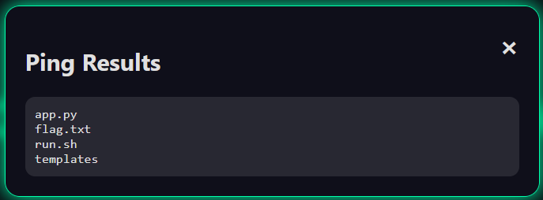

# ping-station-v2

## Descriere

Scopul este să identificăm și să exploatăm o vulnerabilitate într-o aplicație web aparent simplă pentru a extrage conținutul fișierului `flag.txt`.

## Serviciu

- Aplicație web care oferă un câmp de text pentru a trimite comenzi `ping` către o adresă IP.
- Fișiere furnizate: capturi de ecran.

## Analiză

Deschizând interfața aplicației putem observa un formular în care putem introduce o adresă IP.

Având în vedere contextul, suspectăm o vulnerabilitate de tip **Command Injection**. Începem testarea prin introducerea unor caractere speciale cum ar fi `;`, `+`, `\`, însă fără efect. În cele din urmă, caracterul `|` funcționează:

Comanda folosită:

192.168.1.1|ls

Aceasta a permis listarea fișierelor de pe serverul aplicației, confirmând vulnerabilitatea:

## Exploatare

Pentru a accesa conținutul fișierului `flag.txt`, folosim comanda:

192.168.1.1|cat${IFS}flag.txt

Explicație:

- `${IFS}` este o variabilă de shell ce înlocuiește spațiul (` `), utilă pentru a evita eventuale filtre de caractere.

Rezultatul returnează flag-ul:

## Flag

this-will-be-dynamic

**Notă:**  
Inițial, flag-ul era afișat fără formatul standard `CTF{...}`, ceea ce a generat confuzie. După ce a fost deschis un ticket pe platforma CyberEDU, echipa de organizare a confirmat că a fost omis un update în aplicație, dar defapt doar au dat update la flag.