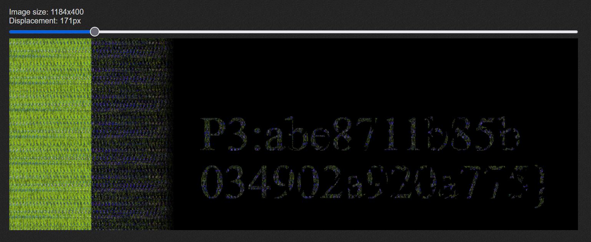
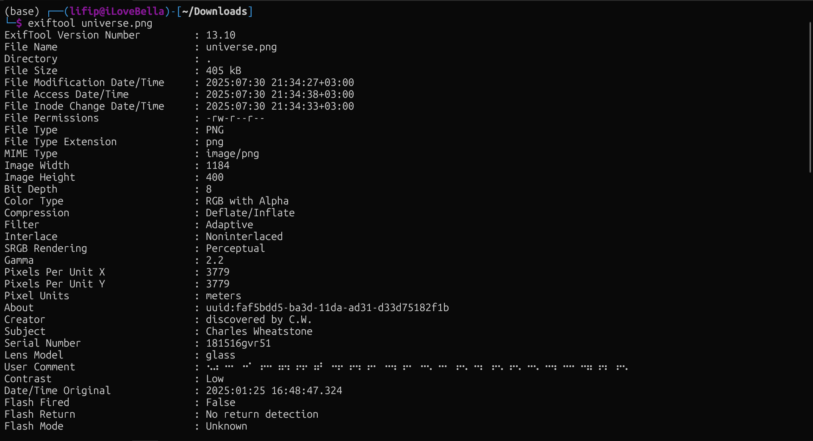
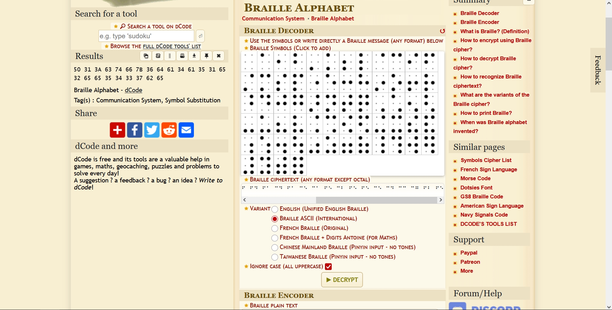
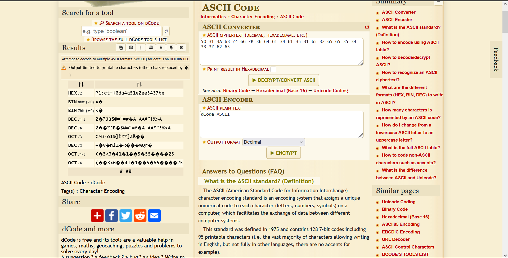
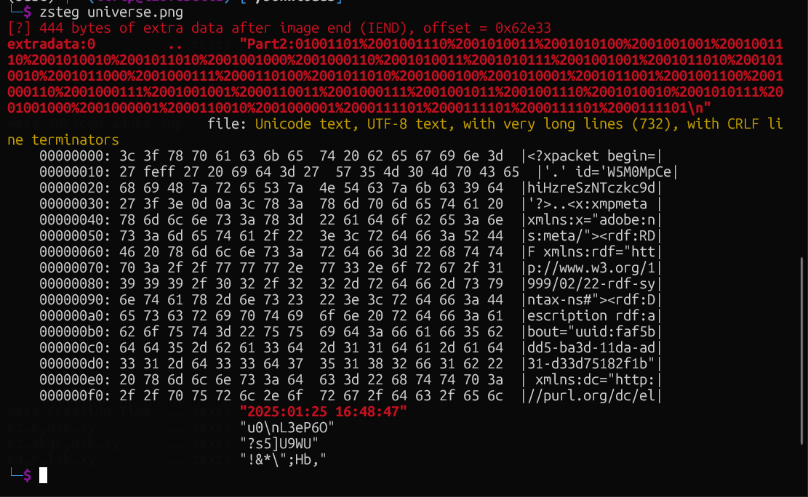
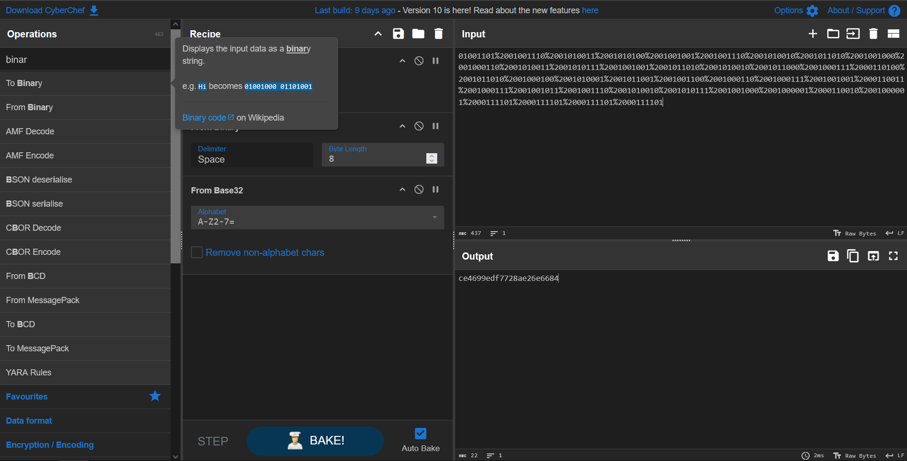

# universe

## DESCRIPTION

What is the technique name? What is the flag?

Fișier: `universe.jpg`

---

## Soluție

Prima dată deschidem imaginea și ne putem da seama că este o **stereogramă**. Cu ajutorul acestui website:  
[https://piellardj.github.io/stereogram-solver/](https://piellardj.github.io/stereogram-solver/)  
aflăm a treia parte din flag. Așadar, mai avem două de găsit.

P3:abe8711b85b 034902a920a775}

Next incercam sa vedem daca poza are metadata (niste informati salvate atunci cand poza este facuta sau adaugate aditional). Cu ajutorul toolului exiftool aflam urmatoarele:

Evident si aceasta parte putea fii obtinuta prin folosirea toolurilor online. https://www.metadata2go.com/.

Pe dcode.fr un site pentru a decrypta diferite mesaje.

Rezultatul este un mesaj in ASCII code.

P1:ctf{6da4a51e2ee5437be

Bun mai avem o singura parte din flag. Ultima sansa este sa cautam folosind diferite tooluri precum binwalk,steghide,zsteg.

First incercam zsteg:

Asadar partea a doua din flag este encryptata in binary. Pe situl cyberchef putem cu usurinta sa decodam:

P2:ce4699edf7728ae26e6684

Asadar flagul este:

# Flag

ctf{6da4a51e2ee5437bece4699edf7728ae26e6684abe8711b85b034902a920a775}