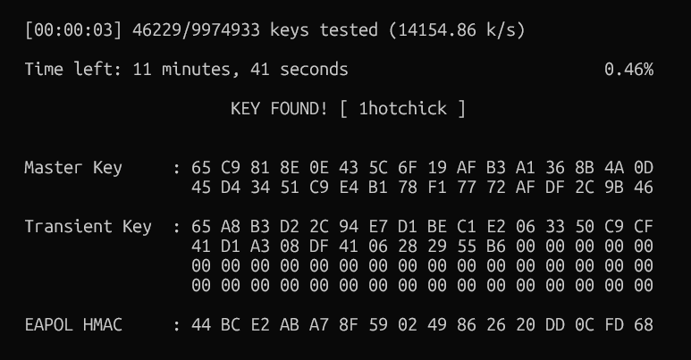

# wifi-get-me

## Descriere

Our surveillance team from the cybercrime unit of X , based on their intelligence documents, are inside an operations van in the area of a location owned by criminal organization Y . They succeed to deauthenticate a persona that is connected to a wireless network owned by the criminal organization Y in order to catch a wi-fi handshake . Also from the intelligence , they found out that the security of the wireless network is WPA2. Help the law enforcement to take the next step in their investigation by cracking the wireless password.

## Fișier

- `handshake.cap`

## Soluție
Pentru a sparge parola rețelei, se folosește utilitarul `aircrack-ng` împreună cu un dicționar de parole. În acest caz, se utilizează wordlist-ul `rockyou.txt`, care se găsește implicit în distribuțiile Kali Linux.

### Comandă utilizată

```bash
aircrack-ng handshake.cap -w /usr/share/wordlists/rockyou.txt
```

## Captură de ecran


